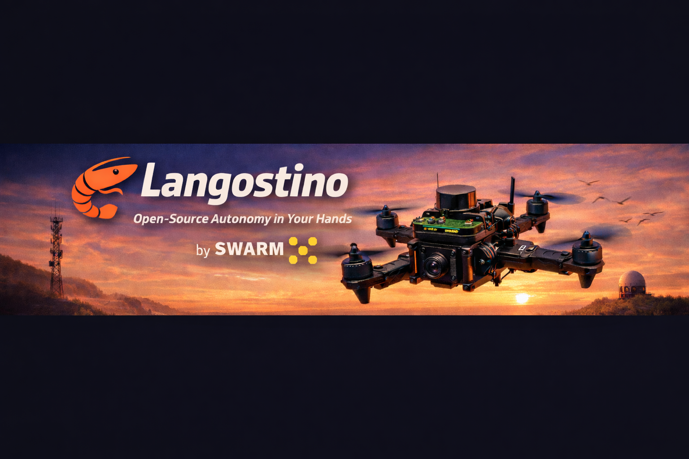

<!-- SECTION 1 -->

  

<h1 align="center">Langostino — The Swarm Drone 🦐</h1>

  <b>Open-source AI autopilot for the real world: understand it, build it, and fly it.</b> 
  An open-source autonomous flight reference platform, built with a <b>global</b> community.

  
  
  
  

  
  

<!-- SECTION 2 -->

<h2 align="center">Step 1 - Assemble the drone and get it to hold position</h2>

  <b>"Build from scratch" drone holding it's position</b> 

<!-- Real flight video (thumbnail clickable) -->

  

<h2 align="center">Step 2 - AI-powered autonomous flight (placeholder)</h2>

  <b>AI-powered navigation (placeholder)</b> 

<!-- Real flight video (thumbnail clickable) -->

  

<h2 align="center">Do it yourself, from ZERO!</h2>

  <b>Example of what you will be building</b> 

<!-- Real flight video (thumbnail clickable) -->

  

  If this made you curious, ⭐ star the repo and share the demo.

<!-- SECTION 3 -->

<h2 align="center">What is Langostino?</h2>

  Langostino is an <b>open-source reference drone</b> for real-world autonomous flight — designed to be easy to understand, build, and extend.

<ul>
  <li><b>A practical AI autopilot project</b> focused on flying in the real world (not a black box).</li>
  <li><b>A complete reference platform</b>: code, docs, and a clear path from “zero” to “first flight”.</li>
  <li><b>Made to be adapted</b>: use it as a starting point for your own drone and your own experiments.</li>
  <li><b>Community-driven</b>: built in the open, improved by builders and contributors worldwide.</li>
</ul>

<!-- SECTION 4 -->

<h2 align="center">Why it matters</h2>

  Autonomous drones shouldn’t feel like magic or closed black boxes. 
  Langostino exists to make real-world autonomy <b>understandable</b> and <b>buildable</b> — so more people can learn, iterate, and ship useful aerial systems. 
  By sharing a reference drone in the open, we lower the barrier from “curious” to “first flight”, and turn progress into something the whole community can reuse.

<!-- SECTION 5 -->

<h2 align="center">Choose your path</h2>

  Pick what you want to do next — you don’t need to be an expert to start.

<table align="center">
  <tr>
    <td width="50%" valign="top">

<b>👀 I’m just curious</b> 

- ▶ Watch the demo (above) 
- ⭐ Star this repo 
- 📣 Share it with a friend

    </td>
    <td width="50%" valign="top">

<b>🔧 I want to build it from scratch</b> 
Assembly guide: 

- <a href="docs/assembly/README.md"><b>docs/assembly/README.md → Build guide</b></a>  
  <i>Includes the parts list (BOM) and step-by-step build instructions.</i>

    </td>
  </tr>

  <tr>
    <td width="50%" valign="top">

<b>🚀 I want to use the model</b> 
Start here: 

- <a href="docs/SETUP_GUIDE.md#quick-setup"><b>SETUP_GUIDE → Quick Setup</b></a>

    </td>
    <td width="50%" valign="top">

<b>🧩 I want to contribute</b> 

- 💬 Join Discord: <a href="https://discord.com/invite/bittensor">discord.com/invite/bittensor</a> 
- 📝 Read: <a href="CONTRIBUTING.md"><b>CONTRIBUTING.md</b></a> 
- 🟢 Pick a starter task:
  <a href="https://github.com/swarm-subnet/Langostino/issues?q=is%3Aissue+is%3Aopen+label%3A%22good+first+issue%22"><b>good first issues</b></a>

    </tr>
  </table>

<!-- SECTION 6 -->

<h2 align="center">FAQ</h2>

<b>Do I need to be an engineer?</b> 
No. Langostino is designed to be approachable: clear docs, a guided setup, and a community that can help you get started.

<b>How do I get started?</b> 
Start with the Quick Start Guide if you already have compatible hardware. Otherwise, refer to the Assembly Guide for a list of materials and steps to follow. Join Discord if you have any questions.

<b>How do I contribute?</b> 
Join Discord, check <a href="CONTRIBUTING.md"><b>CONTRIBUTING.md</b></a>, and pick a <a href="https://github.com/swarm-subnet/Langostino/issues?q=is%3Aissue+is%3Aopen+label%3A%22good+first+issue%22"><b>good first issue</b></a>.

<!-- SECTION 7 -->

<h2 align="center">Your flight plan — from zero to first flight</h2>

<ol>
  <li>
    
<b>Watch a 60-second demo.</b> Get the idea fast. 
      <a href="#REAL_FLIGHT_VIDEO_URL" target="_blank" rel="noopener noreferrer">Watch video →</a>
    

  </li>
  <li>
    
<b>Get the parts.</b> Use the <a href="docs/assembly/README.md#bill-of-materials-bom" target="_blank" rel="noopener noreferrer"><b>BOM</b></a> as your shopping list to source every component.
    

  </li>
  <li>
    
<b>Assemble the airframe.</b> Follow the build guide step-by-step. 
      <a href="docs/assembly/README.md" target="_blank" rel="noopener noreferrer">Build guide →</a>
    

  </li>
  <li>
    <b>Install, then wire it up.</b> Follow the quickstart checklist step by step.
    <a href="docs/quickstart/README.md"><b>Quickstart →</b></a>
  </li>
  <li>
    
<b>Calibrate &amp; safety.</b> Props off, arming checks, failsafes, first hover indoor. 
      <a href="docs/quickstart/README.md#safety--calibration" target="_blank" rel="noopener noreferrer">Safety checklist →</a>
    

  </li>
  <li>
    
<b>Go outside &amp; share.</b> Short flight, record a clip, ⭐ the repo, post your build. 
      <a href="https://discord.com/invite/bittensor" target="_blank" rel="noopener noreferrer">Join Discord →</a>
    

  </li>
</ol>

  Want the bigger picture? See the company roadmap:
    <a href="https://swarm124.com/decentralized-training" target="_blank" rel="noopener noreferrer">Swarm roadmap →</a>
  

<!-- SECTION 8 -->

<h2 align="center">Safety note</h2>

  <b>Langostino is a real flying machine.</b> 
  Follow local regulations. 
  Test in safe environments. 
  Use prop guards and appropriate failsafes.

<!-- SECTION 8.5 -->

<h2 align="center">Deep Dive Articles</h2>

  Want to understand the project in depth? Check out our Substack series that walks through every aspect of building and flying Langostino.

<table align="center">
  <tr>
    <th>Chapter</th>
    <th>Topic</th>
    <th>Description</th>
  </tr>
  <tr>
    <td><a href="https://substack.com/home/post/p-175604069"><b>Chapter 1</b></a></td>
    <td>Inside the Drone</td>
    <td>Hardware components and drone anatomy</td>
  </tr>
  <tr>
    <td><a href="https://substack.com/home/post/p-176136139"><b>Chapter 2</b></a></td>
    <td>The Wiring Brain</td>
    <td>Wiring, connections, and power distribution</td>
  </tr>
  <tr>
    <td><a href="https://substack.com/home/post/p-177453660"><b>Chapter 3</b></a></td>
    <td>From Data to Motion</td>
    <td>Software architecture and data flow</td>
  </tr>
  <tr>
    <td><a href="https://substack.com/home/post/p-180586067"><b>Chapter 3.5</b></a></td>
    <td>Additional Configurations</td>
    <td>Advanced configuration and tuning</td>
  </tr>
</table>

<!-- SECTION 9 -->

<h2 align="center">Documentation Index</h2>

  Find detailed guides for every aspect of the project.

<table align="center">
  <tr>
    <th>Category</th>
    <th>Document</th>
    <th>Description</th>
  </tr>
  <tr>
    <td><b>Building</b></td>
    <td><a href="docs/assembly/README.md">Assembly Guide</a></td>
    <td>Complete build guide from parts to first flight</td>
  </tr>
  <tr>
    <td></td>
    <td><a href="docs/assembly/BOM.md">Bill of Materials</a></td>
    <td>Full parts list with purchase links</td>
  </tr>
  <tr>
    <td><b>INAV</b></td>
    <td><a href="docs/INAV_GUIDE.md">INAV Configuration</a></td>
    <td>Flight controller setup, PID tuning, MSP configuration</td>
  </tr>
  <tr>
    <td><b>ROS2</b></td>
    <td><a href="docs/SETUP_GUIDE.md">Setup Guide</a></td>
    <td>Ubuntu + ROS2 Humble installation on Raspberry Pi</td>
  </tr>
  <tr>
    <td></td>
    <td><a href="docs/COMMANDS_GUIDE.md">Commands Guide</a></td>
    <td>ROS2 commands and node operations</td>
  </tr>
  <tr>
    <td></td>
    <td><a href="docs/CONFIG_PARAMS_GUIDE.md">Config Parameters</a></td>
    <td>Complete ROS2 node configuration reference</td>
  </tr>
  <tr>
    <td><b>Tools</b></td>
    <td><a href="mapproxy/README.md">Map Proxy</a></td>
    <td>Offline map tile server for ground station</td>
  </tr>
  <tr>
    <td><b>Help</b></td>
    <td><a href="docs/TROUBLESHOOTING_GUIDE.md">Troubleshooting</a></td>
    <td>Common issues and solutions</td>
  </tr>
  <tr>
    <td></td>
    <td><a href="CONTRIBUTING.md">Contributing</a></td>
    <td>How to contribute to the project</td>
  </tr>
</table>

<!-- SECTION 9.5 -->

<h2 align="center">Project Structure</h2>

  
<b>Click to expand</b>

  <pre><code>
swarm-ros/
├── src/
│   └── swarm_ai_integration/       # Main ROS2 package
│       ├── swarm_ai_integration/   # Python nodes (FC adapter, LiDAR, AI)
│       ├── config/                 # ROS2 parameter files
│       ├── launch/                 # Launch files
│       └── scripts/                # Utility scripts
├── scripts/
│   ├── setup_22_04.sh              # Ubuntu 22.04 setup script
│   ├── setup_24_04.sh              # Ubuntu 24.04 setup script
│   ├── network_setup_*.sh          # Network configuration scripts
│   ├── verify_setup.sh             # Installation verification
│   └── launch.sh                   # Quick launch script
├── docs/
│   ├── assembly/                   # Build guides and BOM
│   ├── SETUP_GUIDE.md              # ROS2 environment setup
│   ├── INAV_GUIDE.md               # Flight controller configuration
│   ├── COMMANDS_GUIDE.md           # ROS2 commands reference
│   ├── CONFIG_PARAMS_GUIDE.md      # Configuration parameters
│   └── TROUBLESHOOTING_GUIDE.md    # Common issues and fixes
├── assets/
│   └── 3D_print_STL/               # 3D printable parts (mounts, etc.)
├── inav-custom-firmware/           # Custom INAV firmware builds
├── mapproxy/                       # Offline map tile server
├── model/                          # AI model files
├── flight-logs/                    # Flight data logs
└── README.md                       # This file
  </code></pre>

<!-- SECTION 10 -->

<h2 align="center">Community</h2>

  Langostino is built with a <b>global</b> community of builders and contributors. 
  If you’re building, testing, or improving it — we want to hear from you.

  

  <a href="https://discord.com/invite/bittensor"><b>Discord</b></a>
  &nbsp;•&nbsp;
  <a href="https://x.com/<X_HANDLE>"><b>X</b></a>
  &nbsp;•&nbsp;
  <a href="https://www.linkedin.com/company/<LINKEDIN_SLUG>/"><b>LinkedIn</b></a>
  &nbsp;•&nbsp;
  <a href="https://github.com/swarm-subnet"><b>GitHub</b></a>

  Share your build log or flight clip in Discord — we feature the best builds.

<!-- SECTION 11 -->

<h2 align="center">Share pack</h2>

  Want to help Langostino reach more builders? Copy/paste one of these.

  
<b>X (Twitter)</b>

   

  <pre><code>
Open-source AI autopilot for real-world drones 🦐✈️

Langostino is a reference drone you can understand, build, and fly — built with a global community.

⭐ https://github.com/swarm-subnet/Langostino
  </code></pre>

  
<b>LinkedIn</b>

   

  <pre><code>
We’re open-sourcing Langostino — an AI autopilot + reference drone focused on real-world flight.

The goal: make drone autonomy understandable and buildable, so more builders can go from “curious” to “first flight”.

Repo: https://github.com/swarm-subnet/Langostino
Discord: https://discord.com/invite/bittensor
  </code></pre>

  
<b>Where to share</b>

   

  <ul>
    <li><b>Hackaday</b> — open hardware / DIY audience</li>
    <li><b>DIY Drones</b> — builders who actually fly</li>
    <li><b>Reddit</b> — consider: r/drones, r/Multicopter, r/robotics (follow each subreddit’s rules)</li>
  </ul>

<!-- SECTION 12 -->

<h2 align="center">License</h2>

  This project is released under the <b>MIT License</b> — see <a href="LICENSE.md"><b>LICENSE</b></a>.

<!-- SECTION 13 -->

  <b>Happy flying!</b> 🦐

