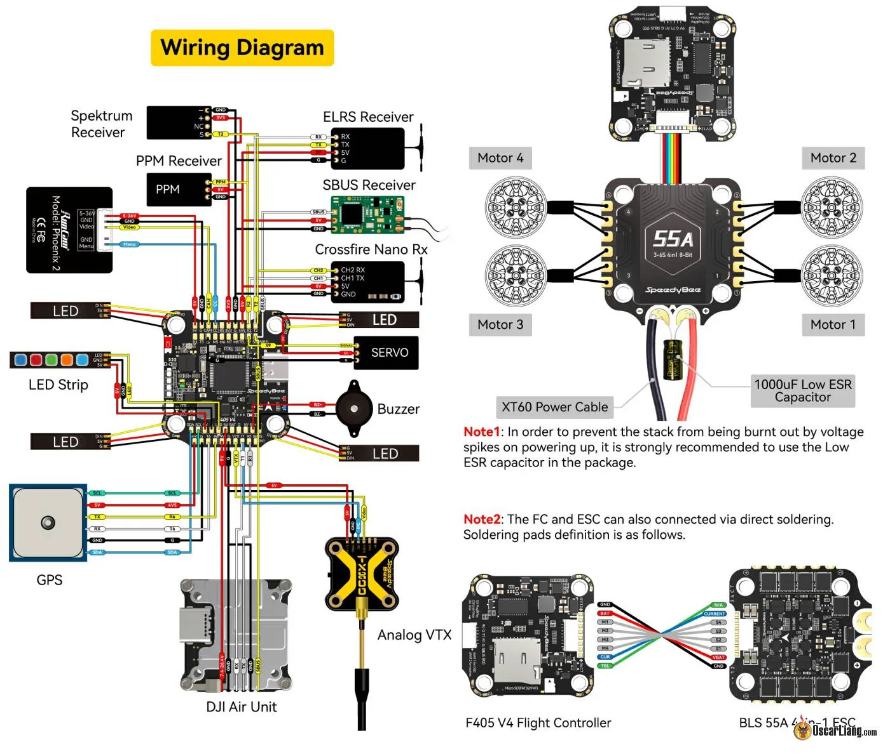
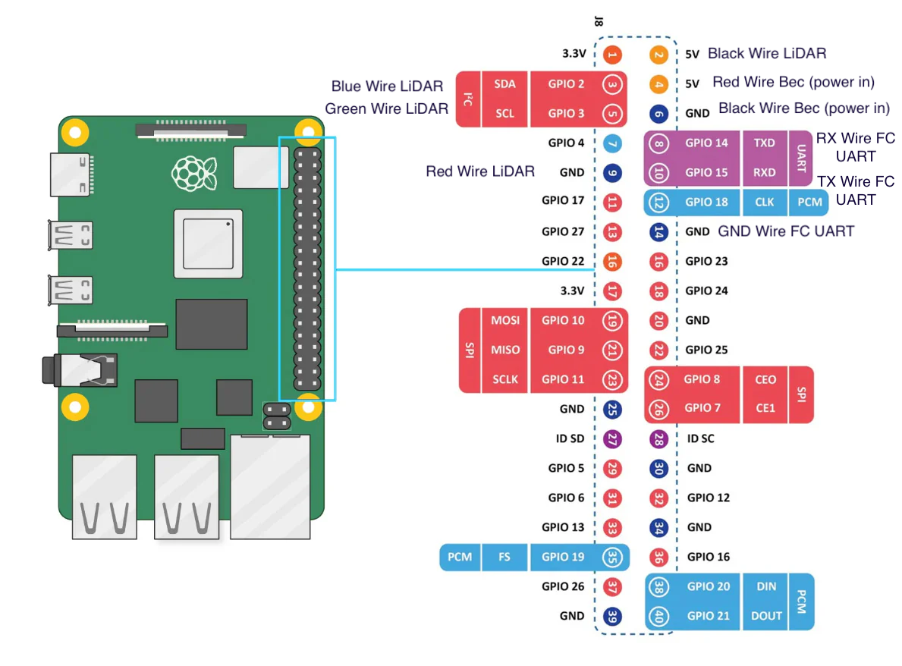
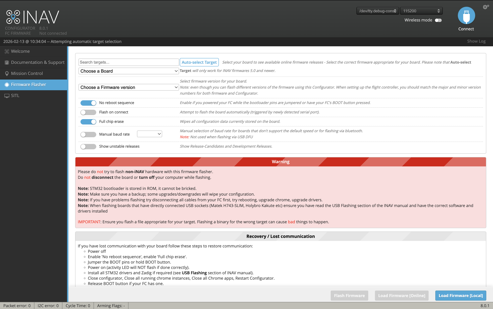
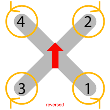

# Build from scratch — Assembly guide 🦐

This guide is your “flight plan” to go from parts → build → first safe flight.

> [!CAUTION]
> **⚠️ Langostino is a real flying machine.**
> * Follow local regulations
> * Test in a safe enviroment responsibly and keep propellers off during bench tests.
> * Drones can cause injury and property damage. 
> * Use prop guards and appropriate failsafes

## Step 0 — Before you start

### Tools (typical)

- Hex drivers / screw set (FPV frame hardware)
- Soldering iron + soldering tin and flux + heatshrink
- Zip ties / cable sleeves (strain relief matters)
- Multimeter (recommended)
- Hot glue gun (recommended).
- Laptop with INAV Configurator installed and type-C USB

## Step 1 — Parts (BOM)

Open: [`./BOM.md`](./BOM.md)

The BOM is your shopping list. It should include:

- Frame
- FC/ESC stack
- Motors + propellers
- Raspberry Pi + microSD card
- LiDAR (down at least, more optional) + 3d printed mounts
- GPS/compass module
- 5V regulator + filtering capacitor
- Receiver
- Autonomous buzzer

## Step 2 — The skeleton (frame) + motors

### 2.1 Build the frame

- Assemble the carbon frame (arms, plates, standoffs)
- Keep it **rigid**: vibrations = noisy data for sensors/AI
- Leave room for: FC stack, wiring, Pi, LiDAR mounts

### 2.2 Mount motors + props (props last)

- Mount motors securely (use thread lock if needed)
- **Do not install propellers yet** — leave them off until the end

### 2.3 Install the FC + ESC stack

- Mount the stack with vibration-damping hardware if available
- Ensure access to:
  - USB port (flashing/config)
  - UART pads/ports (GPS/MSP/etc.)
  - power leads (battery input)

> Why INAV: unlike Betaflight (manual-first), **INAV** is built for navigation/autonomy and supports MSP-based control paths.

## Step 3 — Sensors + “field” essentials

### 3.1 LiDAR

- Install LiDAR downward-facing (front-facing optional)
- Use stable mounts (3D-printed mounts help reduce vibration + keep alignment)
- Keep cables tidy and strain-relieved

### 3.2 GPS

- Mount the GPS with good sky visibility
- Keep it away from noisy power lines, like awg 12 battery wires if possible

### 3.3 Receiver

- Install a receiver so you can always take back control
- Confirm that you have a good control before autonomy flights

### 3.4 Autonomous buzzer (highly recommended)

- Install an autonomous buzzer connected to the FC on BZ+ and BZ-.
- Purpose: finding the drone after unexpected landings/crashes

## Step 4 — Wiring (power + data)


_SpeedyBee F405 V4 wiring diagram_

This is where "circuits meet code".

> 📖 **Deep Dive:** For a detailed walkthrough of the wiring and connections, see [Chapter 2: The Wiring Brain](https://substack.com/home/post/p-176136139) on our Substack.

### 4.1 Clean power (very important)

- Battery feeds ESC → motors
- A regulator steps down high voltage to **clean 5V** for the Raspberry Pi.
- Add a **filtering capacitor** on the power line:
  - reduces electrical noise from motors
  - helps protect electronics from voltage spikes

> If power is noisy, sensors can drift and the AI can “react” to bad data.

### 4.2 Data buses: UART + I²C

#### UART (direct “hotline”)

Used for FC ↔ Raspberry Pi (telemetry + commands).

- On the Pi, stable device paths often look like `/dev/ttyAMA0` / `/dev/ttyAMA1`
- Keep UART wiring short/clean where possible

##### FC UART assignments

| UART | Function |
|------|----------|
| UART 2 | ELRS receiver |
| UART 3 | FC to Raspberry Pi communications |
| UART 4 | Not used |
| UART 5 | Internal telemetry with ESCs |
| UART 6 | GPS and compass |

#### I²C (shared "group chat")

Used for multiple sensors on the same bus.

- LiDAR modules communicate via I²C
- Each has its own address so they don't collide

#### Raspberry Pi 5 GPIO Connections

<p align="center">
  
</p>

| Pin | Function | Connection |
|-----|----------|------------|
| 2 | 5V VCC | LiDAR power |
| 3 | SDA (I²C) | LiDAR SDA |
| 4 | 5V | Raspberry Pi power input |
| 5 | SCL (I²C) | LiDAR SCL |
| 6 | GND | Raspberry Pi power GND |
| 8 | TXD (UART) | FC RX |
| 9 | GND | LiDAR GND |
| 10 | RXD (UART) | FC TX |
| 14 | GND | FC UART GND |

> **Note:** TXD → RX and RXD → TX: UART lines cross between devices.

## Step 5 — Raspberry Pi software (Ubuntu + ROS2 + Swarm stack)

Follow the quick setup:
[`../SETUP_GUIDE.md#quick-setup`](../SETUP_GUIDE.md#quick-setup)

In most cases you’ll run:

```bash
sudo ./setup.sh
./verify_setup.sh
./launch.sh
```

If you hit issues, go to:
[`../TROUBLESHOOTING_GUIDE.md`](../TROUBLESHOOTING_GUIDE.md)

## Step 6 — INAV setup (firmware + parameters + MSP path)

### 6.1 Flash INAV (if not already)

- Use INAV Configurator firmware flasher
- Flash a supported INAV build for your flight controller. For SpeedyBee F405 V4, use our custom firmware: [`inav_8.0.1_SPEEDYBEEF405V4.hex`](../../inav-custom-firmware/inav_8.0.1_SPEEDYBEEF405V4.hex)
- Reboot and confirm the FC connects properly


_Flasher option of INAV configurator_

### 6.2 Apply baseline parameters (copy/paste script)

Use:
[`../INAV_GUIDE.md#complete-configuration-script-inav-cli-commands`](../INAV_GUIDE.md#complete-configuration-script-inav-cli-commands)

### 6.3 MSP / RC override

From [`../INAV_GUIDE.md#msp-configuration`](../INAV_GUIDE.md#msp-configuration):

- `msp_override_channels` defines which RC channels can be overridden via MSP.

**Build-guide checklist (repo-confirmed + typical practice):**

- Configure your INAV parameters (script above)
- Set `msp_override_channels` as documented (e.g. `127` or `255` depending on your channel plan)
- Ensure you have a working manual override (radio receiver) before autonomy tests

> Note: enabling MSP/override end-to-end often involves both **parameters** (like `msp_override_channels`) and **port configuration** in INAV Configurator. Port specifics vary by FC and wiring.

## First flights (do this in order)

### Bench test (props off)

- Power on, confirm FC boots normally
- Confirm sensors are detected (as per setup docs)
- Run [`../../scripts/verify_setup.sh`](../../scripts/verify_setup.sh)
- Confirm launch is stable and logs are clean
- Confirm motor spin direction. Set reverse motor spin direction to follow this diagram:


_Drone motor spin direction_

> **Fixing wrong motor direction:** If any motor spins the wrong way, you can reverse it using the [ESC Configurator](https://esc-configurator.com). Connect the FC via USB, open the tool in a Chrome-based browser, select your ESC firmware (BLHeli_S / BLHeli_32 / AM32), and toggle the **Motor Direction** for the affected motor(s). Flash the updated settings and verify the correct spin direction.

### Manual flight first

Before autonomy:

- Confirm arming checks pass
- Confirm vibrations are reasonable
- Confirm GPS meets minimum sats and is stable
- Confirm flight mode works

### Then autonomy experiments

- Start conservative
- Keep safe altitude and space
- Log everything and iterate