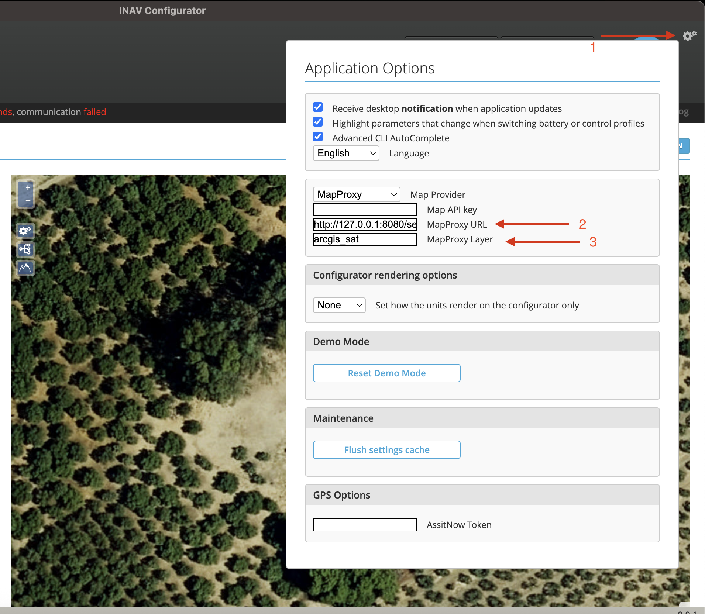

# MapProxy - Satellite image map server

MapProxy, a local tile caching proxy for ArcGIS World Imagery satellite tiles. Provides satellite imagery for INAV Configurator's Mission Control with local caching to reduce bandwidth and improve loading times (so you can use it even without internet connection). If you plan to fly somewhere that is not shown on a street/basic map, you need this satellite image map.

## Installation

```bash
cd mapproxy

# Create virtual environment
python3 -m venv venv

# Activate virtual environment
source venv/bin/activate

# Install dependencies
pip install -r requirements.txt
```

## Usage

### Start the server

```bash
./launch_mapproxy.sh
```

Or manually:
```bash
source venv/bin/activate
mapproxy-util serve-develop mapproxy.yaml -b 0.0.0.0:8080
```

The server will be available at `http://localhost:8080`.

### INAV Configurator Setup

In INAV Configurator, go to **Mission Control** and configure:

| Setting | Value |
|---------|-------|
| Map Provider | `MapProxy` |
| MapProxy URL | `http://127.0.0.1:8080/service` |
| MapProxy Layer | `arcgis_sat` |


_Step to configure mapproxy on INAV configurator_

### Available endpoints for testing

| Service | URL |
|---------|-----|
| Demo/Preview | http://localhost:8080/demo/ |
| WMS | http://localhost:8080/service?SERVICE=WMS&REQUEST=GetCapabilities |

## Cache

Tiles are cached in `./cache_data/`. Delete this folder to clear the cache.
